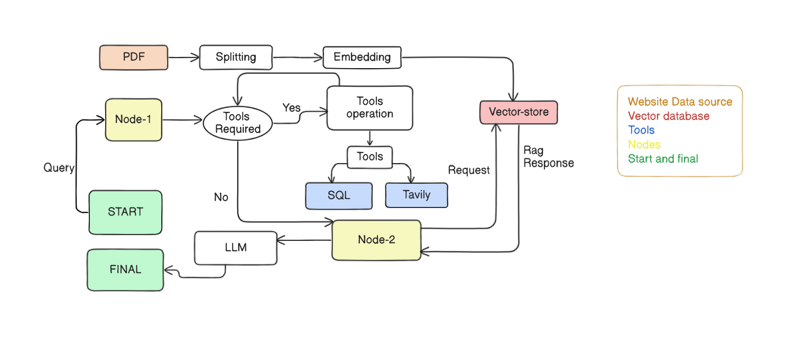

<h1 align="center">🚀 Ai travel planner</h1>

<p align="center">
  Ai travel planner <br/>
  A system that finds one of the best places around the globe
</p>

---




## 🧠 About

This project uses LangChain to intelligently suggest the best travel destinations based on user preferences and travel days. It integrates Retrieval-Augmented Generation (RAG) to fetch and display relevant website data, providing rich contextual details about each place. Powered by tools like SQL, Tavily, and modern web technologies, the app delivers smart, day-specific travel planning with real-time insights.

---

## 🛠️ Tech Stack

| Frontend |     Backend     | Database | Styling   |         Ai          |
|----------|-----------------|----------|-----------|---------------------|
| Next.js  | Express,fastapi | MySQL    | Tailwind  | langchain,langgraph |

---

## ✨ Features

- 📋 Dynamic routing with Next.js
- 🛠️ RAG implementation
- 💾 MySQL database integration
- 🔐 Secure API endpoints
- 💻 Fully responsive design
- ✨ Amazing plan by ai

---

## 🚀 Getting Started
# Clone the repo
git clone git@github.com:jenasuraj/Ai-TravelPlanner-app.git


# required dependencies front end
npx create-next-app@latest next-frontend<br/>
cd next-frontend<br/>
npm run dev


# required dependencies for Express  
mkdir express-backend
cd express-backend
npm init -y
npm install express cors dotenv
node index.js


# required dependencies for fastapi
python -m venv venv
source venv/bin/activate 
pip install fastapi uvicorn
uvicorn main:app --reload
Your FastAPI server runs at http://127.0.0.1:8000

```
