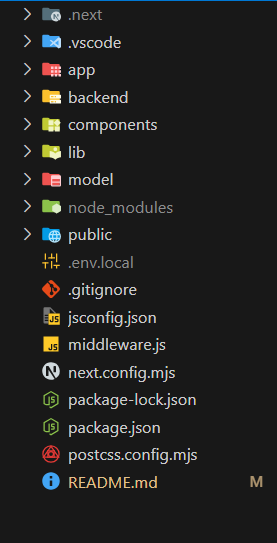

<p align="center">
    
</p>

<p align="center">
  <a href="https://www.linkedin.com/in/suraj-jena-0991a121a/">
    
  </a>
  <a href="https://x.com/jenasuraj_">
    
  </a>
</p>

# <div align="center">🐺 Explora.ai</div>

Explora.ai is a full-stack AI-powered travel planner that helps users create personalized and optimized itineraries. It leverages multiple LangGraph nodes to generate structured travel plans, ensuring the best recommendations based on user preferences, travel days, and radius. The application uses MongoDB to store user information and itineraries, Express and FastAPI for backend endpoints, Clerk for authentication, and Next.js for a responsive, interactive frontend experience.

---


## Technologies used 

| Component Overview | Name             | Primary Function                                  | Key Tools                           |
|----------------------|-----------------|--------------------------------------------------|-----------------------------------------------|
| Component-1          | Frontend        | Responsive and interactive user interface       | Next.js, TailwindCSS, React Icons, Clerk      |
| Component-2          | Backend API     | Handles itinerary requests and user interactions | FastAPI, Express, Python                      |
| Component-3          | Authentication  | User account creation and login                 | Clerk                                         |
| Component-4          | Database        | Store user info and itineraries                 | MongoDB                                       |
| Component-5          | AI Planner      | Generate structured travel plans based on user input | LangGraph                          |
| Component-6          | Integration     | Connect frontend and backend seamlessly         | Axios, REST APIs                              |
| Component-7          | Deployment      | Hosting and running the full-stack app         | Vercel (frontend), Render (backend)          |


## Folder structure
<p>
    
</p>


</br>
</br>

## 🛠 Installation 

### 1. Clone the Repository
```bash
git clone git@github.com:jenasuraj/Explora.git
cd Explora
```
### 2. Set up frontend
```bash
npm install
npm run dev
Next.js server will run at http://localhost:3001
```
### 3. set up backend
```bash
cd backend
python -m venv venv
venv\Scripts\activate
pip install -r requirements.txt
uvicorn main:app --reload
FastAPI server will run at http://127.0.0.1:8000
```
